# 线上演示操作记录

演示站点：http://1.117.230.218

演示赛事：README流程演示赛-20260625030716

赛事 ID：2

报名记录 ID：2

获奖审核记录 ID：2

## 操作过程截图

### 1. 校级管理员填写账号密码

在登录页展开“管理员账号登录”，输入校级管理员账号。

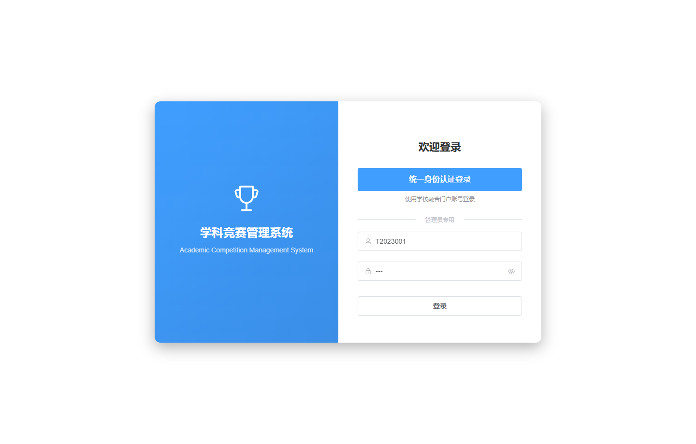

### 2. 校级管理员登录进入首页

登录后进入系统首页，侧边栏展示可访问的管理模块。

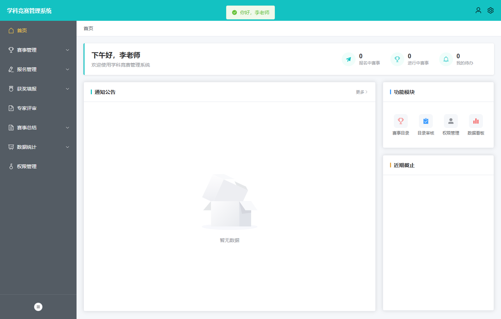

### 3. 创建赛事后查看赛事目录

创建赛事「README流程演示赛-20260625030716」后，赛事目录出现该条记录。

### 4. 配置报名规则

进入报名规则配置页，可看到团队赛、报名时间、作品提交时间、赛道和奖项层级。

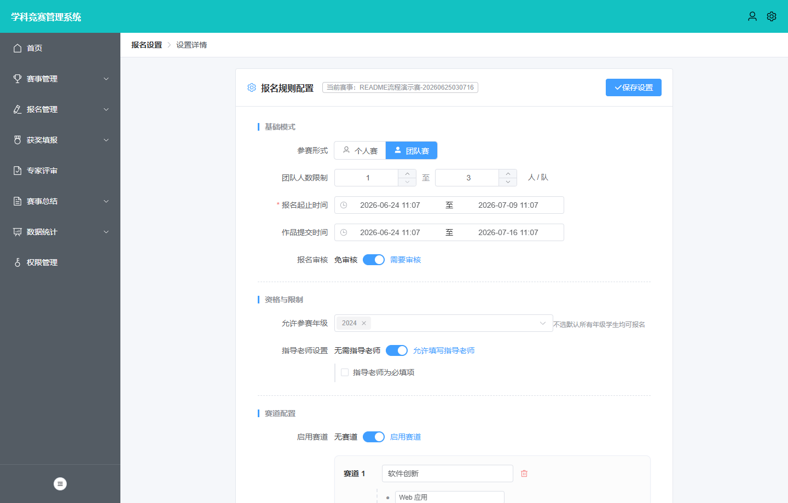

### 5. 学生查看可报名赛事

学生账号进入赛事报名页，可看到刚创建并开放报名的赛事。

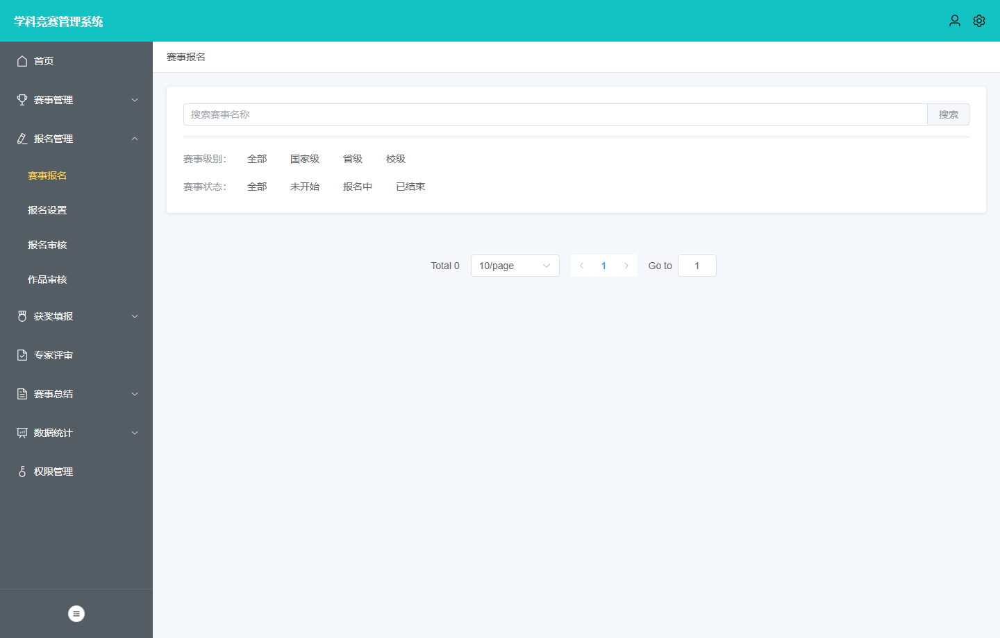

### 6. 学生提交报名后查看报名状态

学生提交团队、负责人、指导老师、附件和赛道信息后，页面显示报名状态。

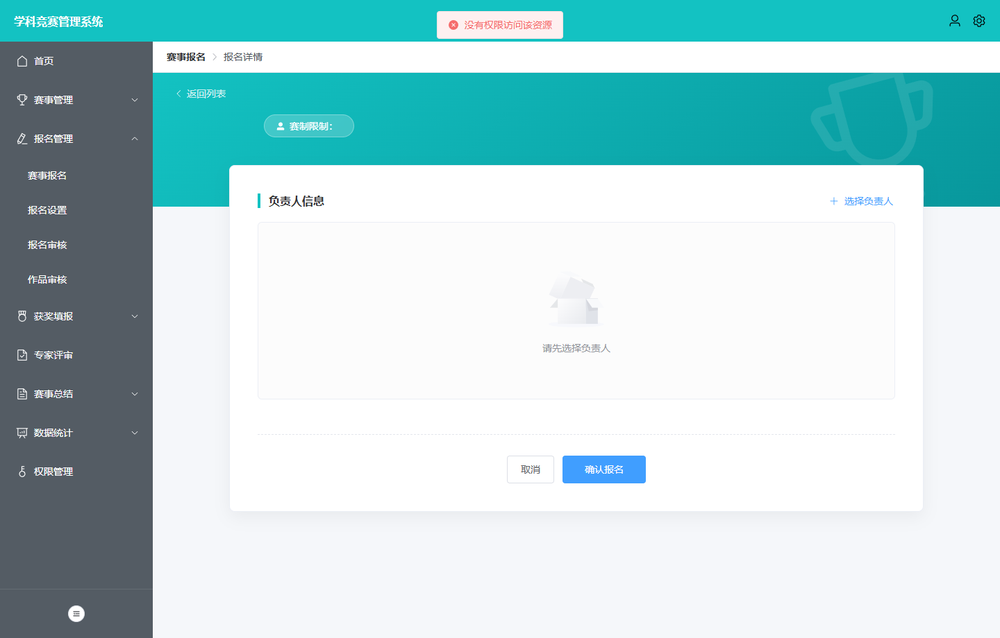

### 7. 管理员查看待审核报名

管理员进入报名审核页，看到学生提交的待审核报名。

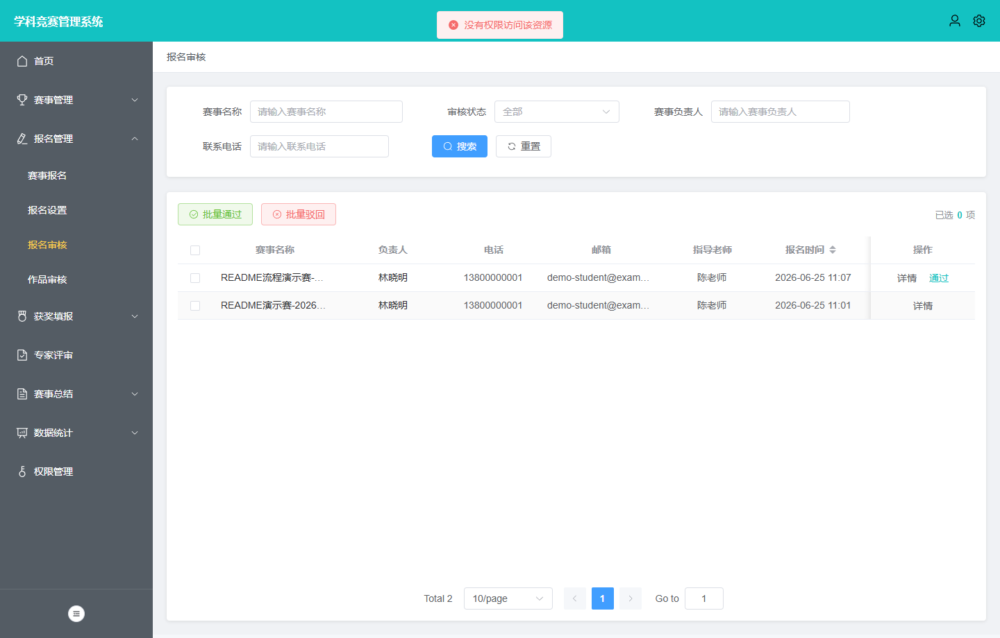

### 8. 管理员通过报名审核

报名审核通过后，列表中的状态变为已通过。

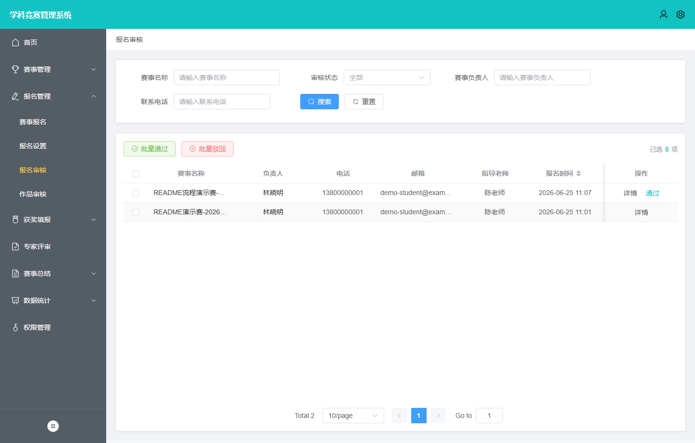

### 9. 学生提交作品后查看作品入口

学生提交作品材料链接后，作品提交页显示可修改作品。

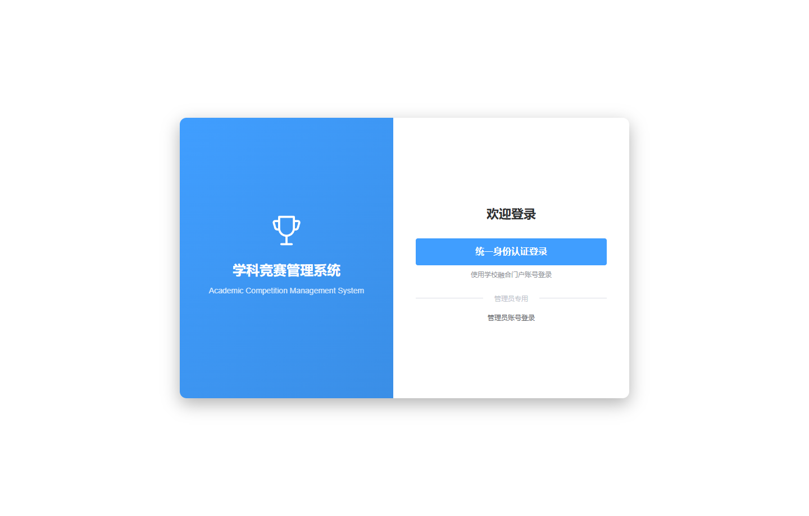

### 10. 管理员查看作品审核

管理员进入作品审核页，看到该赛事已有作品提交数量。

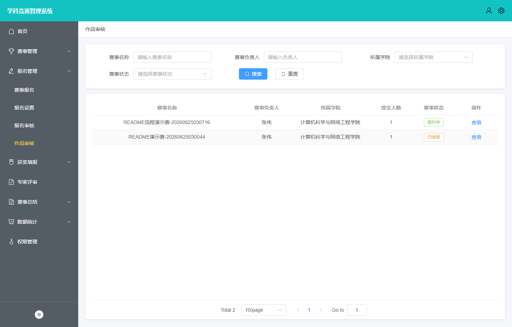

### 11. 学生查看竞赛/获奖中心

学生提交获奖补录后，可在学生侧竞赛中心查看相关记录入口。

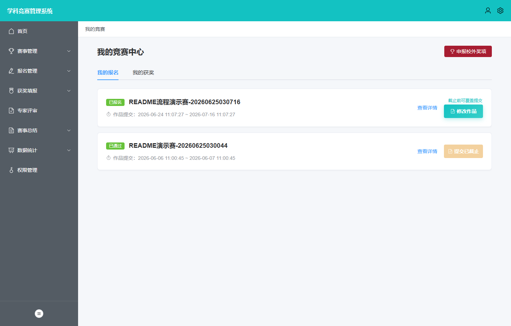

### 12. 管理员查看待审核获奖补录

管理员进入填报审核页，看到学生提交的获奖补录待审核记录。

### 13. 管理员通过获奖审核

获奖审核通过后，审核列表状态更新为已通过。

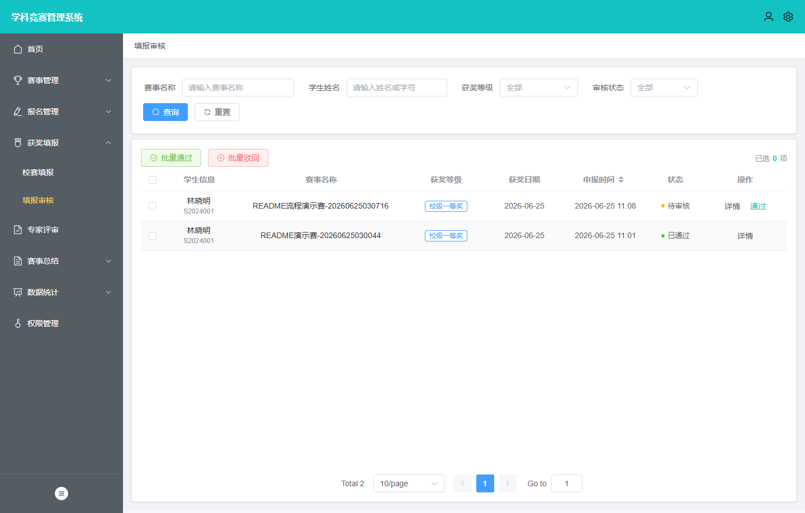

### 14. 赛事结束后进入总结列表

将演示赛事调整为已结束后，赛事总结列表出现该赛事。

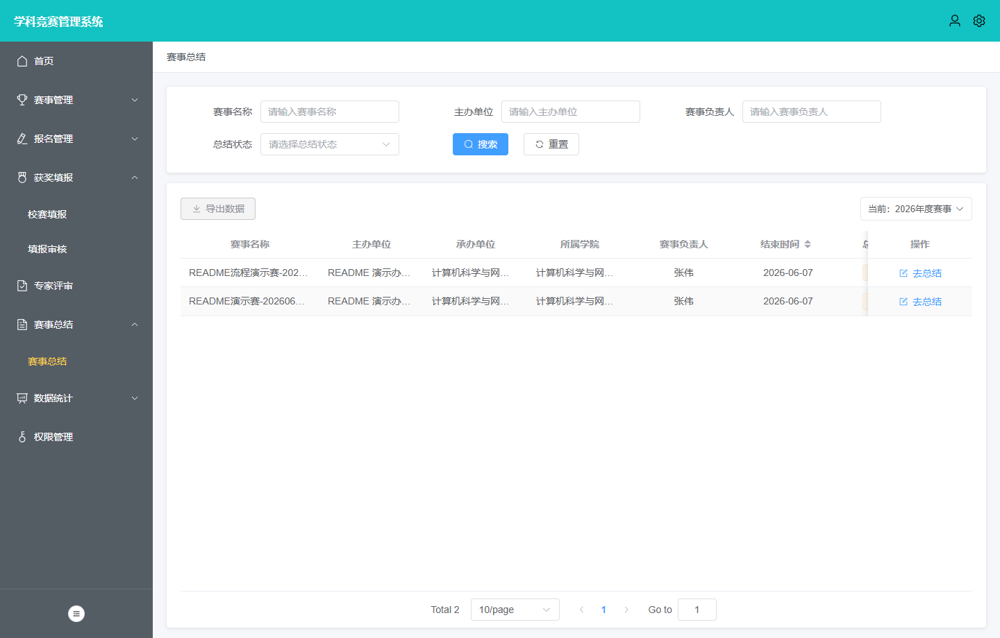

### 15. 管理员填写赛事总结

管理员保存总结草稿，经费明细和附件信息用于总结归档。

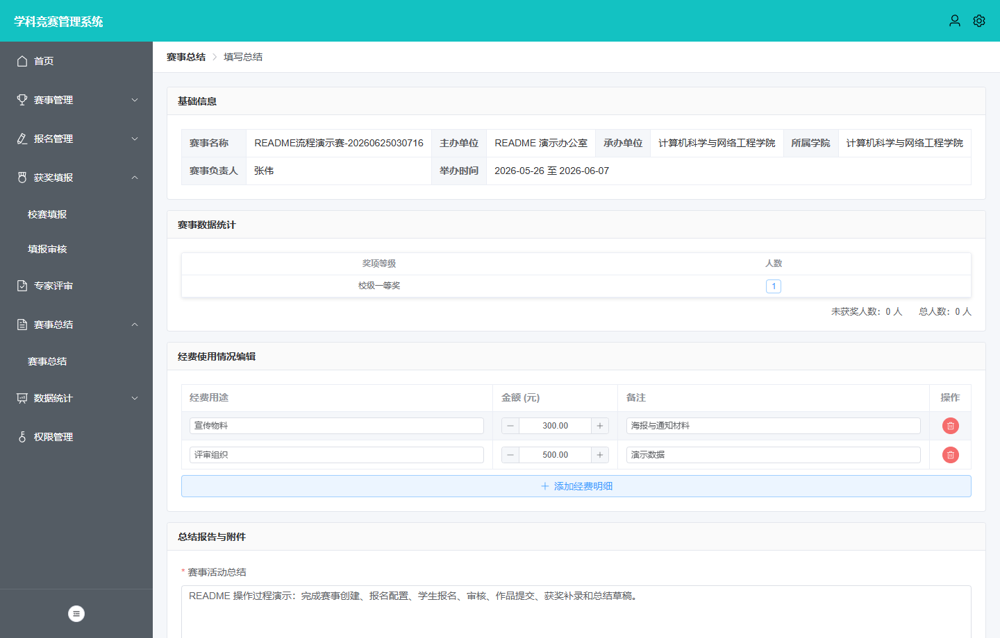

### 16. 数据统计看板反映业务数据

完成赛事、报名、获奖和总结链路后查看统计看板。

## 说明

- 本记录由 `scripts/capture-demo-operation-flow.mjs` 在已部署的线上演示环境自动执行生成。
- 截图按业务动作发生顺序生成，展示的是操作过程中的界面状态，不只是功能页巡览。
- 部分写入动作通过前端同源 REST API 执行，再立即打开对应前端页面截图；数据会真实写入演示数据库。
- DataHall 外部同步保持关闭，演示数据不包含真实学生或教职工信息。
